## **Table of Contents**

* [Documentation: How It Works](#documentation-how-it-works)
  * [Core Architectural Principles](#core-architectural-principles)
  * [Organizational Units: The Flexible Hierarchy](#organizational-units-the-flexible-hierarchy)
  * [Multi-Tenancy: Root Organization as Tenant](#multi-tenancy-root-organization-as-tenant)
  * [Roles, Permissions, and Access Control](#roles-permissions-and-access-control)
  * [Dynamic Workflows](#dynamic-workflows)
  * [Super Admin Functionality](#super-admin-functionality)
  * [Ensuring Data Integrity: Cycle Detection](#ensuring-data-integrity-cycle-detection)
* [Future Enhancements](#future-enhancements)

## **Documentation: How It Works**

This section explains the core architectural principles and key modules of the ERP backend.

### **Core Architectural Principles**

The ERP system is designed for maximum flexibility and scalability, focusing on:

* **Modularity:** Breaking down functionality into distinct, reusable modules. 
* **Dependency Injection:** Leveraging NestJS's powerful DI container for managing services and their dependencies. 
* **Type Safety:** Extensive use of TypeScript across the entire codebase to reduce errors and improve maintainability. 
* **Data Integrity:** Implementing robust checks to maintain the consistency and correctness of hierarchical data.

### **Organizational Units: The Flexible Hierarchy**

The system models organizational structures using a generic concept of "Organizational Units." This allows for highly flexible and non-uniform hierarchies across different branches or organizations.

* **Definition:** An OrganizationalUnit is a fundamental entity characterized by:
  * `id`: A unique identifier. 
  * `name`: A descriptive name (e.g., "Head Office", "Finance Department", "Addis Branch"). 
  * `parentUnitId`: An optional reference to another OrganizationalUnit's `id`, establishing the hierarchy. A `null` `parentUnitId` indicates a root-level organization. 
  * `type` (optional but recommended): A semantic label (e.g., "Organization", "Branch", "Department", "SubDepartment") used for UI presentation and specific business logic, but **not** for enforcing the hierarchy itself. The hierarchy is purely determined by `parentUnitId`. If a unit's classification changes, its `type` attribute is updated accordingly. 
* **Example Hierarchy:**

### **Multi-Tenancy: Root Organization as Tenant**

A crucial aspect of this ERP is its multi-tenancy capability, where each root-level OrganizationalUnit functions as a distinct tenant.

* **Tenant Identification:** The id of a root OrganizationalUnit (where parentUnitId is null) serves as the unique tenantId for all data belonging to that organization. 
* **Data Segregation:** Every entity that holds tenant-specific data (e.g., Users, Roles, Permissions, Workflows, Budget Plans) includes a tenantId column. 
* **Automatic Filtering:**
  * During authentication, the authenticated user's tenantId is extracted (which corresponds to their root organization's id). 
  * This tenantId is stored in a **request-scoped TenantContext**. 
  * A **TypeORM TenantAwareSubscriber** intercepts all database queries for tenant-aware entities. It automatically injects a WHERE tenantId \= :currentTenantId clause, ensuring that users only access data relevant to their organization.
  * During **insertion**, the TenantAwareSubscriber automatically populates the tenantId for new tenant-aware entities from the TenantContext, preventing accidental cross-tenant data creation. 
* **Multi-Tenancy Data Flow:**

### **Roles, Permissions, and Access Control**

The system implements a robust Role-Based Access Control (RBAC) mechanism.

* **Permissions:** The most granular level, defining specific actions (View, Create, Update, Delete, Approve, Reject) for features (e.g., "Budget Plan", "User Management").
* **Roles:** Collections of Permissions. Roles provide a logical grouping of authorizations (e.g., "Budget Preparer", "Department Head", "Finance Manager").
* **Users:** Each user is assigned a single primary Role and belongs to a specific OrganizationalUnit. Access checks leverage the user's role and their organizational context.

### **Dynamic Workflows**

Workflows enable multi-stage approval processes that can be customized to any depth.

* **Workflow Definition:** A template for a specific workflow (e.g., "Budget Plan Approval"). 
* **Workflow Step Definition:** Defines individual stages within a workflow, including: 
  * stepOrder: The sequence of the step. 
  * requiredRoleIds: Roles eligible to approve this step. 
  * requiredOrganizationalUnitIds: Specific organizational units whose members are eligible. 
  * requiredPermissionIds: Permissions needed to perform the action at this step.
* **Workflow Instance:** Represents an actual item (e.g., a specific Budget Plan) moving through an approval process. 
* **Workflow Task:** Records individual approval/rejection actions taken by users at specific steps. 
* **Simplified Workflow Process:**

### **Super Admin Functionality**

A powerful "Super Admin" account exists with unique capabilities:

* **Global Visibility:** The super admin can view all data across all tenants. This is achieved by the TenantAwareSubscriber checking an isSuperAdmin flag in the TenantContext and **bypassing tenantId filtering** for super admin queries. 
* **Explicit Data Assignment:** When a super admin creates or modifies tenant-specific data, they **must explicitly provide the target tenantId** in the request payload. This prevents accidental data assignment and ensures conscious management. 
* **Tenant Setup:** The super admin is responsible for creating initial root-level OrganizationalUnits (new tenants) and their first administrator users, thus setting the foundation for each tenant's isolated data.

### **Ensuring Data Integrity: Cycle Detection**

To prevent logical errors and infinite loops in hierarchical structures (like OrganizationalUnits, or any other data with parent-child relationships), the system employs a generic cycle detection mechanism.

* A **GraphCycleDetectorService** implements a Depth-First Search (DFS) algorithm. 
* This service can be injected into any module that manages hierarchical data. 
* When a new parent-child relationship is proposed (e.g., creating a new department under an existing one, or re-parenting a branch), the service checks if this change would create a circular dependency. If a cycle is detected, the operation is rejected, maintaining data integrity.

## **Future Enhancements**

* **Seeder:** Implementation of database seeders for populating initial data for development and testing environments, including setting up initial super admin accounts and a sample tenant structure.

